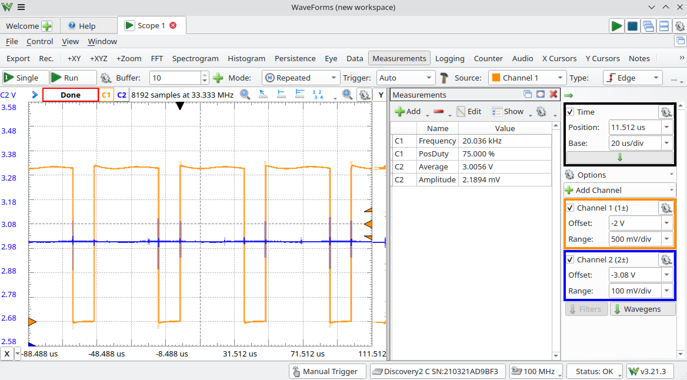
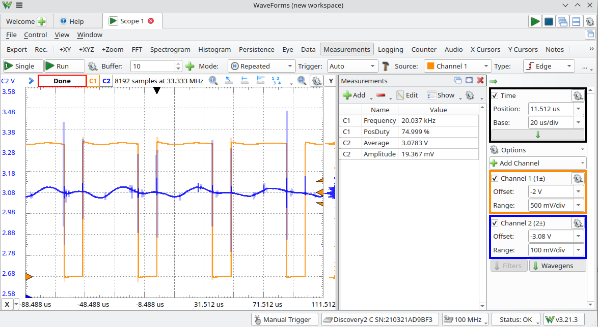
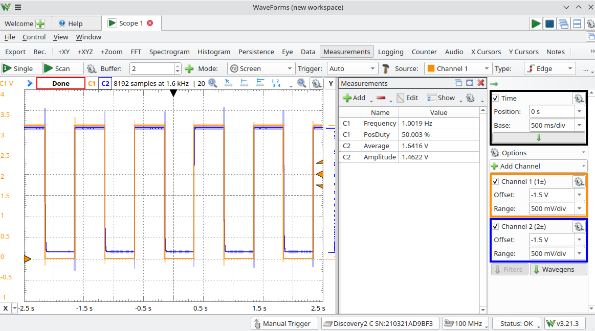

Chapter 24.1.2, 24.2.1 and 2, 24.3.1 and 2.

Be ready to use python for second half of this assignment.

Sample code in Files/ch24 on Canvas.

## 24.1.2. 
Choose R. Wire the circuit as shown in Figure 24.2, except for the connection
from the LED to OC1. The LED and phototransistor should be pointing toward each
other, with approximately one inch separation, as shown in Figure 24.4. Now choose R to
be as small as possible while ensuring that the voltage Vout at the phototransistor emitter is
close to 3 V when the LED anode is connected to 3.3 V (maximum LED brightness) and
close to 0 V when the LED anode is disconnected (the LED is off). (Something in the
10 kohm range may work, but use a smaller resistance if you can still get the same voltage
swing.) Record your value of R. Now connect the anode of the LED to OC1 for the rest of
the project.

The selected value is 4.63kOhm. The value is decently smaller due to a very good alignment between 
LED and phototransistor.

## 24.2 Powering the LED with OC1
### 1. 
PWM calculation. You will use Timer3 as the timer base for OC1. You want a 20 kHz PWM on OC1. Timer3 takes the PBCLK as input and uses a prescaler of 1. What should PR3 be?

Timer3, 
PBCLK is 48MHz.
Prescaler of 1. 

48MHz / 20kHz  = 2400 (count)
PR3 = 2399

### 2.
PWM program. Write a program that uses your previous result to create a 20 kHz PWM output on OC1 (with no fault pin) using Timer3. Set the duty cycle to 75%. Get the following screenshots from your oscilloscope:

### a. 
The OC1 waveform. Verify that this waveform matches your expectations.

### b. 
The sensor voltage Vout. 

This is a combined plot for part a and b

Channel1: Waveform at OC1, (orange)
Channel2: Waveform at sensor. (blue)

see `p24.2_pwm.c` for code.

### c.
Now remove the 1 uF capacitor and get another screenshot of Vout. Explain the difference from the previous waveform.
Insert the 1 uF capacitor back into the circuit for the rest of the project.

The waveform without cap have a lot more amplitude from peak to peak. With cap, the sensor signal is filtered. Which result in almost flat reading. Without the cap, the voltage change is more obvious.

## 24.3

### 1. 
Get a screenshot of your oscilloscope trace of Vout showing 2-4 periods of what should be an approximately square-wave sensor reading.

Square wave Vout (blue) compare to the LED outupt pin (orange)

### 2. 
Turn in your code.

See `pwm_fb.c` for code