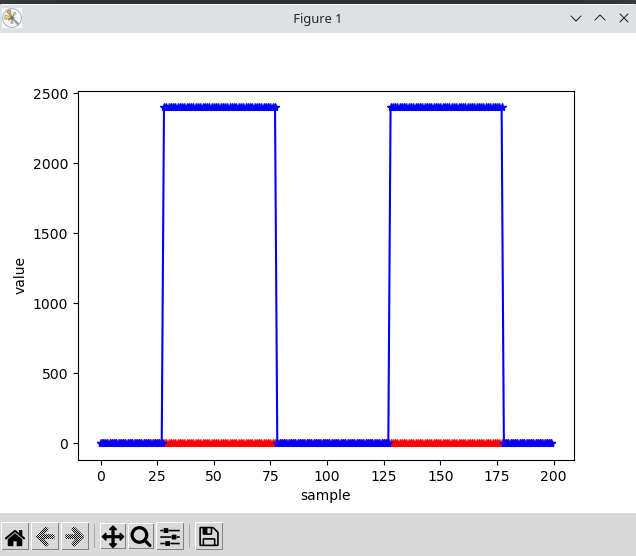
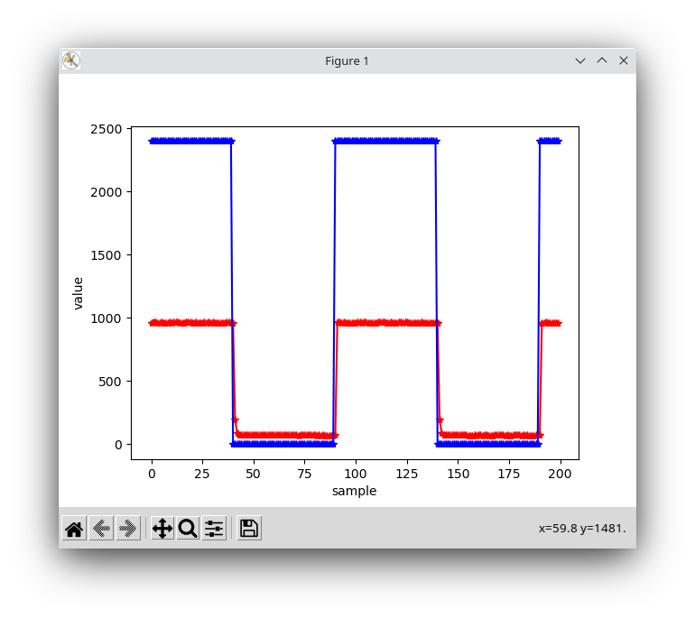
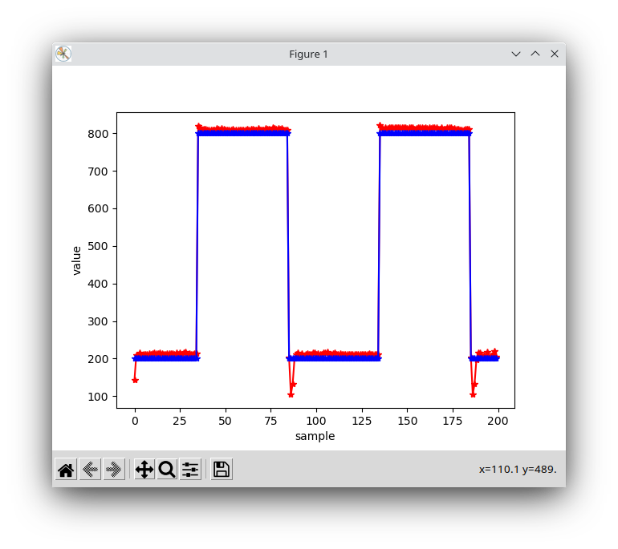

Chapter 24.5, 24.7, and 24.8. Make a demo video for 24.8 for the Demonstration assignment.

## 24.5
Turn in a MATLAB plot showing pid_plot.m is communicating with your PIC32 code.

for pic32DIP, using the python program to do this.

## 24.7

Read the ADC value in your ISR, just before the if (StoringData) line of code. The
value should be called adcval, so it will be stored in ADCarray. Turn in a MATLAB plot
showing the measured ADCarray and the REFArray. You may wish to use manual sampling
and automatic conversion to read the ADC.

The python program output with ADC doing reading

## 24.8

With KP=0.11 KI=0.03, I got a decent tracking with some small initial overshot.

See `main.c` for code, and PIcontrol.mp4 for the demo video.