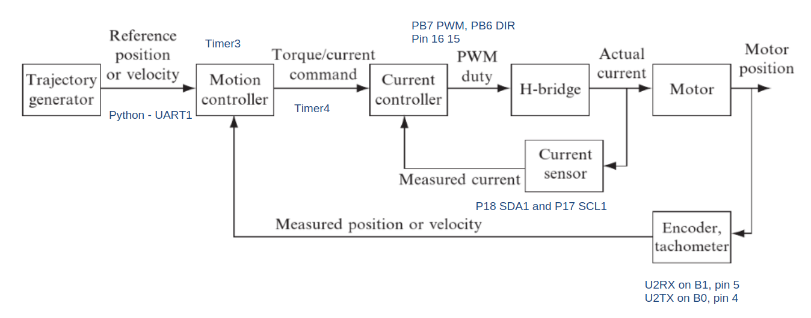
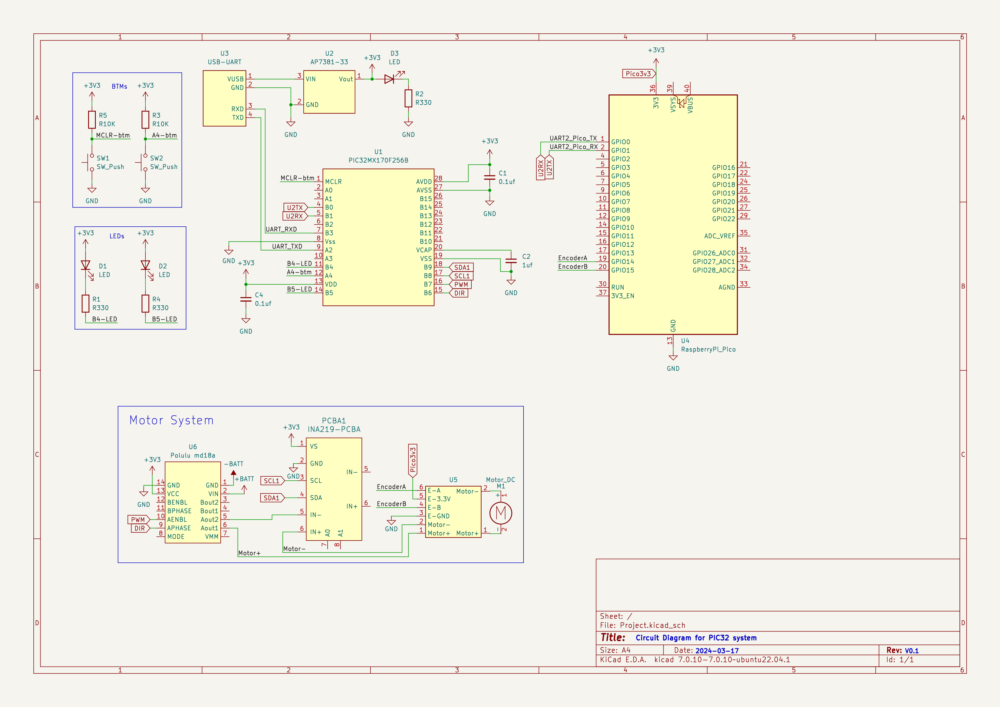
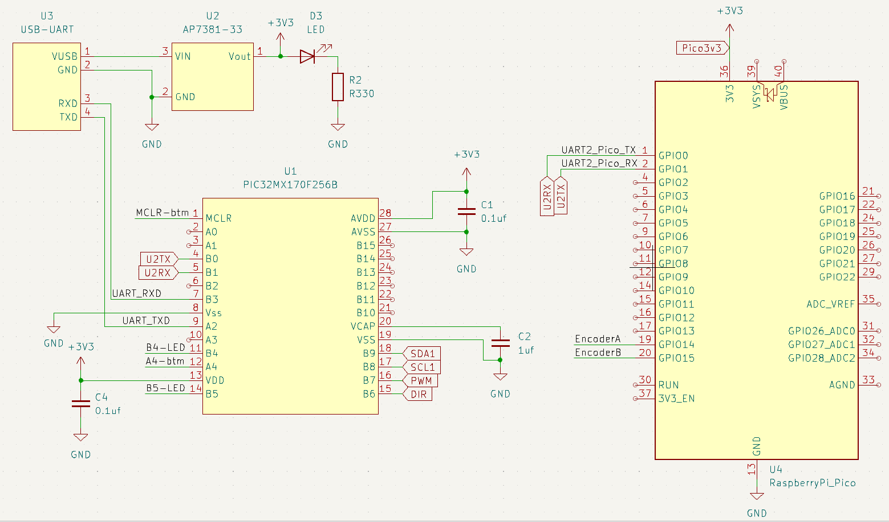
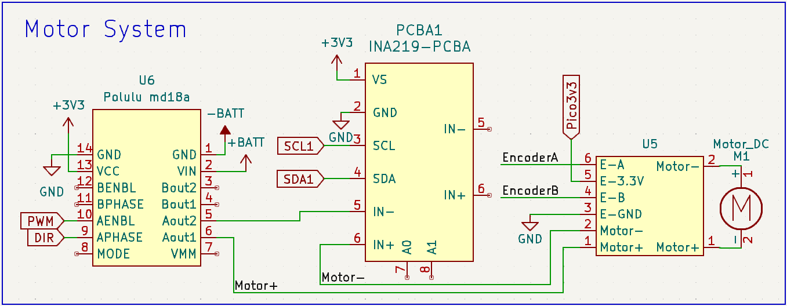

28.4.1 #7, 28.4.7 #7, 28.4.9 #8

# 28.4.1

### 1. 
The NU32 communicates with the encoder counter by an SPI channel. Which SPI channel
will you use? Which NU32 pins does it use?

With the NU32DIP, the communication to encoder now goes through the UART with PiPico and using PiPico's SPI bus. 

PIC will use UART2 to communicate to PICO. 

UART2's two pin: U2TX and U2RX are PPS pins.

U2RX on B1, pin 5
U2TX on B0, pin 4

### 2. 
The NU32 reads the MAX9918 current sensor using an ADC input. Which ADC input
will you use? Which NU32 pin is it?

With NU32DIP, the current is read using INA219 breakout board, it use I2C to communicate. 

We use I2C 1 on PIC, which connects the module to P18 SDA1 and P17 SCL1

### 3.
The NU32 controls the DRV8835 H-bridge using a direction bit (a digital output) and
PWM (an output compare and a timer). Which peripherals will you use, and which NU32
pins?

To Generate PWN, we need to use a output comparator and timer. I choose OC1 with RPB7, Pin16 as output PWM, with Timer2. 

Then PB6, Pin 15 as direction.

### 4.
Which timers will you use to implement the 200 Hz position control ISR and the 5 kHz
current control ISR? What priorities will you use?

Either timer will work for controlling the Position loop and current loop. I will pick Timer 3 and 4 for simplicity.

The current loop runs a lot more frequent, thus it will have a higher priority then others. I will set them up for 
priority 4 and 5. 

### 5.
Based on your answers to these questions, and your understanding of the project, annotate
the block diagram of Figure 27.7. Each block should clearly indicate which devices or
peripherals perform the operation in the block, and each signal line should clearly indicate
how the signal is carried from one block to the other. (After this step, there should be no
question about the hardware involved in the project. The details of wiring the H-bridge,
current sensor, and encoder are left to later.)

### 6.
Based on which circuit boards need to be connected to which pins of the NU32, and the
connections of the circuit boards to the motor and encoder, sketch a proposed layout of the
circuit boards relative to the NU32 so that wire crossing is approximately minimized. (Do
not make a full circuit diagram at this time.)

Circuits are break into two main sections. 

