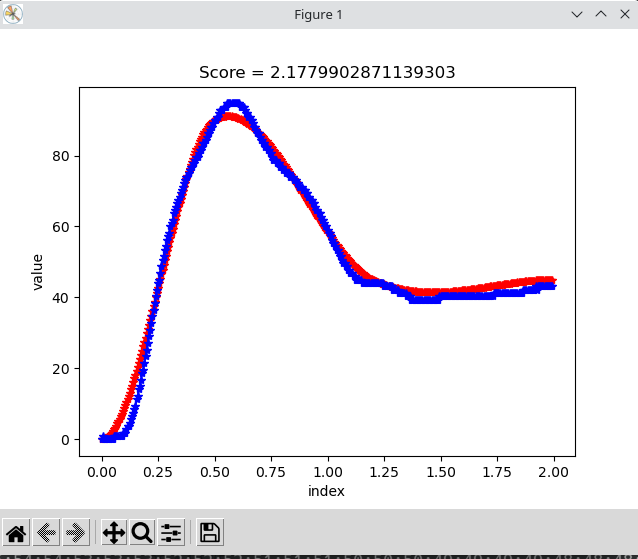

28.4.10 \#5

The best current graph is shown here, with no load attached to motor

The gain used are P:0.1 I:0.01. The gain changes error to percent of PWM
duty cycle. (negative change direction). So the unit for P and I is
`Duty_percent/mA`

28.4.12 \#5

The PID Gain I used is 70 0 70

Since the mounting of the motor is not idea, the exact value and result changes as the tape gets loose.

Since I have converted everything to encoder reading when doing PID,
there are quite a bit of rounding error in the output. 

